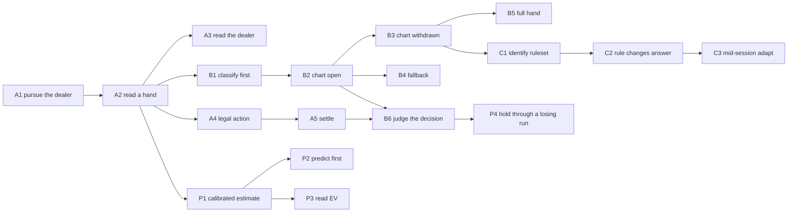

# Learning Outcomes and the Skill Graph — LDB-01

> **Status: draft for approval.** Gate: user-approval. This is deliverable 1 (skill graph and
> prerequisites) and deliverable 2 (learning outcomes including probability, EV and variance) of
> ROADMAP Phase 4.
>
> **Binding input:** `docs/superpowers/specs/2026-07-22-product-design-inputs.md`. Its §0 states what
> may not be leaned on. Nothing in Phases 1–3 is reopened here.
>
> **What this decides.** The capability each unit produces, what must precede what, and the two
> bridge decisions that have no other owner (EV, and the simplified heuristic). It does **not**
> decide activity formats (LDB-03), mastery thresholds (LDB-04), or session shape (LDB-06).

---

## 0. The three inputs, at their correct evidence levels

Three ladders are inherited. They sit at different altitudes and carry different labels, and the
distinction is load-bearing — §B of the Phase 2 audit is free to change with a label, §C needs
playtest data before it can be asserted.

| Inherited ladder | Altitude | Label | Register |
|---|---|---|---|
| 7-rung vision ladder (`product-vision.md:12-18`) — Basic Strategy → shoe → running count → true count → count-aware → cognitive load → advanced | long-term product arc | Product judgement + coverage gap (`K-U2-003`) | none required |
| 7-stage progression (`learning-mastery-and-scoring.md:38-47`) — game → rule → chart literacy → decision recall → procedural transfer → ruleset transfer → automaticity | capability ladder | **Assumption** (`K-U1-003`) | **`A-01`, Low** |
| Subject A/B/C spine (`v2-research-02-curriculum-and-pedagogy.md:21-53`) — Foundations / Strategy Table Fundamentals / Rule Variation Literacy | curriculum units | Product judgement (`K-U7-008`) | none required |

**This document adopts the Subject A/B/C spine as its organising structure** (Product judgement, free
to change) and **declines to assert the 7-stage progression as a prerequisite ordering**. The stages
survive as vocabulary, not as edges. Where a real prerequisite edge exists, §3 states it and labels
it individually; where the only warrant would have been "stage *n* precedes stage *n+1*", no edge is
drawn. `A-01` stays open at Low confidence and is not spent here.

**Scope.** Subjects A, B and C, plus a cross-cutting probability/EV/variance strand. Card counting
is **out of scope** — it is rungs 3–5 of the vision ladder, and `learning-mastery-and-scoring.md:53`
already limits current work to "the first four stages and table-open transfer."

---

## 1. The admissibility test every outcome passes

> An outcome is admissible if it names something the learner **does**, in a form a recorded attempt
> can satisfy or fail, without asking the learner what they know or how confident they are.

This is §1.7 operationalised — 198 students taught probability with gambling examples showed superior
odds calculation and resistance to fallacies six months later, and **no change in actual gambling
behaviour**. Knowledge gain and behaviour change are separate outcomes and this product wants the
second. The test rejects three shapes:

- **"Understands / knows / explains X"** — a knowledge claim. Rewritten into the decision that would
  distinguish a learner who has it from one who does not.
- **"Feels confident about X"** — never, in any form. §1.5: brief practice significantly raised
  confidence on an outcome participants could not influence. Confidence appears in no outcome here
  and must appear in no mastery calculation (`A-17`).
- **"Selects the correct option about X"** — admissible **only** where the real task is itself
  recognition (§4.1). `C1` is the only outcome that qualifies; every other outcome is a decision.

One consequence worth stating plainly, because it is where the test does real work: `A1` below was
`goal` — "Explain the goal of blackjack" (`blackjack-basics.ts:14`). Explaining it cannot distinguish
a learner who says the right words and still hits a 13 against a dealer 6. The observable version can.

---

## 2. The outcomes

Two levels. **Outcomes** are the coarse capability, and the approvable unit. **Skills** are the
evidence grain and the graph's nodes — `AttemptRecord.outcomeId` is already a validated foreign key
into `Subject.skills` (`validate.ts:51-55`, `journal/decisions.md:33`), so skills are where recorded
evidence already lands. Existing skill ids are preserved verbatim; new ids are marked **new**.

### Subject A — Blackjack Foundations

| # | Outcome (observable decision behaviour) | Skills |
|---|---|---|
| **A1** | **Pursue the dealer, not 21.** Given a low total against a weak dealer upcard, stand rather than hit. | `goal` |
| **A2** | **Read a hand before acting.** Given a dealt hand, produce its total and its class — hard, soft, pair, natural, or bust — as a required input *before* any action is offered. | `card-values`, `hand-total`, `ace-value`, `bust`, `natural-blackjack` |
| **A3** | **Read what the dealer shows and what it hides.** State the upcard and, *before the reveal*, predict the dealer's forced draw sequence under the active rule. | `dealer-info` |
| **A4** | **Take a legal action through a full round.** Play a round to resolution choosing only legal actions, including after a split. | `hit`, `stand`, `double`, `split`, `split-hands`, `round-flow`, `complete-round` |
| **A5** | **Settle a round before it settles itself.** *Before* the payout renders, state win / loss / push and the consequence for the original wager. | `outcomes`, `wager-result` |

`A1`'s discriminating case is the one where "maximise my total" and "beat the dealer" give different
answers; measured anywhere else it is not measuring the outcome. `A2` is §4.3 — an activity that tells
the learner "this is a soft total" is not measuring the skill. `A3` and `A5` are predict-then-reveal
(§4.4), which is what turns settlement from a readout into a decision.

### Subject B — Strategy Table Fundamentals

| # | Outcome | Skills |
|---|---|---|
| **B1** | **Classify before lookup.** Produce the classification in the order pair → soft → hard, as a required step, before any chart access or action. | `classify-pair` **new**, `classify-soft` **new**, `classify-hard` **new** |
| **B2** | **Choose the charted action with the chart open.** With the chart visible, choose the action the *active ruleset's* chart specifies. | `chart-navigate` **new**, `dealer-column` **new** |
| **B3** | **Choose the charted action with the chart withdrawn.** The same, unaided. | `recall-hard` **new**, `recall-soft` **new**, `recall-pairs` **new** |
| **B4** | **Fall back correctly when the action is illegal.** When double or surrender is unavailable, choose the charted fallback rather than the unavailable action. | `fallback-notation` **new** |
| **B5** | **Play a full evolving hand at charted correctness.** Every decision in a multi-decision hand — post-split, post-double — is charted-correct. | `full-hand-transfer` **new** |
| **B6** | **Judge the decision, not the result.** Shown a correct decision that lost and an incorrect decision that won, identify which was sound; and in own play, do not change a charted-correct action after a loss. | `decision-outcome-split` **new** |

**`B3` deliberately does not specify the fading rungs.** The *principle* — fade assistance before
counting evidence as independent — is evidence-backed; the *specific rungs* (table open → hidden →
hidden at pace) are `A-04` / `K-U2-006`, an Assumption. Naming rungs here would spend an open
assumption on an unrelated card. LDB-04 and LDB-07 own the rungs.

**`B6` is the product's stated differentiator** (`product-vision.md:74-75`, implemented at
`controller.ts:210`) and the most fragile outcome in this document. §1.3: outcome bias reproduced at a
*larger* effect than the original in a pre-registered N=692 replication, and persisted **among
participants who had themselves stated that outcomes should not be considered**. The attitudinal
version of this outcome is therefore worthless — a learner agreeing with the principle measures
nothing. Both halves as stated are behavioural. **Provisional on `P-1` / `A-13`.**

### Subject C — Rule Variation Literacy

Introduced only after baseline fluency (`v2-research-02:46` — Product judgement).

| # | Outcome | Skills |
|---|---|---|
| **C1** | **Identify the active ruleset.** Given a table, state H17/S17, deck count, DAS, surrender availability, and payout, before playing it. | `identify-dealer-rule` **new**, `identify-deck-count` **new**, `identify-table-terms` **new** |
| **C2** | **Change the answer when the rule changes.** Given the same hand under two rulesets, choose correctly under each. Scored on the cells that *move*, not the cells that agree. | `delta-cells` **new** |
| **C3** | **Adapt to a rule change introduced mid-session.** A rule card appears mid-session, unannounced as relevant; subsequent delta-cell decisions change accordingly, unprompted. | `mid-session-rule-adapt` **new** |

`C1` is the one recognition outcome, admissible because the real task *is* recognition. `C2`'s scoring
rule is what stops it re-measuring `B3` — the shared cells carry no ruleset information.

`C3`'s form comes from `U3-5` (dynamic assessment with an embedded learning resource), whose source
states the format saw something no other instrument could: *"The two forms of instruction would have
looked the same had we not included the resource item from which students could learn."*
`run/U3/audit.md` names this exact target as the Subject C ruleset-transfer analogue. **Constraint 3
of `FOR-LDB-03.md` applies**: the source establishes the format's power in its own domain and makes
no claim about blackjack. The extension is this project's — registered as `A-25`.

### The probability, EV and variance strand

Cross-cutting rather than a fourth subject: these attach to hands played in A, B and C, not to a
separate course.

| # | Outcome | Skills |
|---|---|---|
| **P1** | **Give a calibrated estimate, not a right answer.** State a two-bound interval or a point probability under a proper scoring rule. Scored on calibration across many estimates — never on one estimate being "right". | `calibrated-estimate` **new** |
| **P2** | **Commit a prediction before any distribution is shown.** No distributional display renders until the learner's prediction is recorded. | `predict-before-reveal` **new** |
| **P3** | **Read an EV statement without using it to decide.** Given two plays and their EV, state which loses less over many hands — and in play, still choose the charted action. | `ev-interpret` **new** |
| **P4** | **Keep playing correctly through a losing run.** After an engineered run of losses under charted-correct play, charted correctness does not drop. | `tail-persistence` **new** |

`P1`'s forms are `U3-8` (continuous probability estimate under a proper scoring rule — one of the six
independent, evidence-backed, substantive rows) and `U1-3` (two-bound interval, hit-rate scored).
Constraint 3 again: these supply the **form**; that the form measures blackjack probability
understanding is this project's extension, not the sources'.

`P2` is §4.4 — a simulation that does not first capture a prediction is decoration. **Stated
honestly:** §4.4's usual citation is §1.4, which `§0` marks `[DEFECTIVE-SOURCE]`. That source was
**not reopened for this document**, so `P2` is carried as an approved product requirement (§4.4), not
as an evidence-backed finding, and is labelled Product judgement accordingly.

`P4` is variance understanding stated as behaviour instead of as a knowledge claim about standard
deviation. §1.2: learners taught by experience systematically underweight rare events — dealer 21s,
long losing runs, the tail that makes variance feel unfair. §4.6: that exposure must be engineered
rather than awaited. **The measure is ambiguous on its own** — persistence could be understanding or
could be stubbornness — and that ambiguity is registered as `A-26` with a named disambiguation.

---

## 3. The skill graph

Prerequisites name **skill ids, not unit ids** (`validate.ts:39`, asserted at
`validate.test.ts:110-114`). The graph below is therefore directly encodable in the shipped schema.

### Edge label taxonomy

Every edge carries exactly one label. The four are distinguished by what would have to be true for
the edge to be wrong:

| Label | Meaning | Register row? |
|---|---|---|
| **DN** — Domain-necessary | Forced by blackjack's mechanics or by arithmetic. Not a learning-science claim; wrong only if the game changes. | No |
| **EB** — Evidence-backed | Supported by evidence this project holds and has opened. Cited inline. | No |
| **PJ** — Product judgement | A design choice. Free to change with a label. | No |
| **AS** — Assumption | Falsifiable, untested, would change under contradicting data. | **Yes** |

Separating **DN** from **PJ** is what keeps this graph from inflating the register: "you cannot total
ranks you cannot value" is not a pedagogical bet, and giving it a row would bury the four edges that
genuinely are bets.

### Subject A

| Edge | Label | Warrant |
|---|---|---|
| `card-values` → `hand-total` | DN | A total is a sum of values. |
| `hand-total` → `ace-value` | DN | Dual valuation is a totalling rule. |
| `hand-total` → `bust` | DN | Bust is defined as a total over 21. |
| `hand-total`, `ace-value` → `natural-blackjack` | DN | A natural is a two-card 21. |
| `card-values`, `hand-total` → `goal` | PJ | `A1`'s discriminating case requires a readable total to act on. |
| `hand-total` → `hit`, `stand` | DN | Both are decisions about a total. |
| `hit`, `stand` → `double`, `split` | **AS** | `K-U7-007` — "teach hit and stand first, then double and split." **No source evidences this ordering.** New row `A-23`. |
| `split` → `split-hands` | DN | Split hands exist only after a split. |
| `round-flow` → `complete-round` | DN | Completion is the round's terminal state. |
| `outcomes` → `wager-result` | DN | Settlement follows from the outcome. |
| `card-values` → `dealer-info` | DN | The upcard is a card. |

### Subject A → B

| Edge | Label | Warrant |
|---|---|---|
| `hand-total`, `ace-value` → `classify-hard`, `classify-soft` | DN | Hard/soft is a property of the total. |
| `card-values` → `classify-pair` | DN | A pair is a rank identity. |
| `classify-*` → `chart-navigate` | PJ | Ordering is a design choice — see the note below. |
| `chart-navigate` → `dealer-column` | DN | The column is part of the lookup. |
| `chart-navigate` → `fallback-notation` | DN | Fallback notation *is* chart notation. |
| `chart-navigate`, `dealer-column` → `recall-*` | **AS** | The fading ladder. Principle EB, rungs untested — `A-04` / `K-U2-006`, existing row. |
| `recall-*` → `full-hand-transfer` | PJ | Multi-decision play composed from single decisions. |
| `outcomes`, `wager-result`, `chart-navigate` → `decision-outcome-split` | DN | Judging a decision against a standard requires both the outcome and the standard. |

**The note on `classify-* → chart-navigate`, because it is easy to overclaim here.** §1.1 is strong —
interleaved practice beat blocked 72% vs 38%, d=1.05, with discrimination errors falling 46% → 10%,
and the authors name the mechanism as discrimination between kinds of problems. The dossier's own
observation is that basic strategy is structurally that task. What this licenses is that
**classification is a separable, trainable capability that practice must never hand to the learner**
— an **EB** requirement, and it is `B1` and §4.3. What it does **not** license is that classification
must be *mastered before* chart navigation begins. That prerequisite is **PJ**. The claim that forcing
an explicit, separately-scored classification step improves decision accuracy is a further step again,
and is registered as `A-24`.

### Subject B → C, and the P strand

| Edge | Label | Warrant |
|---|---|---|
| `recall-*` → `identify-dealer-rule`, `identify-deck-count`, `identify-table-terms` | PJ | "Introduce only after baseline fluency" (`v2-research-02:46`). |
| `identify-*` → `delta-cells` | DN | A delta is defined between two identified rulesets. |
| `delta-cells` → `mid-session-rule-adapt` | PJ | Unprompted adaptation composed from prompted adaptation. |
| `hand-total` → `calibrated-estimate` | DN | The estimate is about a hand. |
| `calibrated-estimate` → `predict-before-reveal` | PJ | Prediction mechanic built on estimation. |
| `calibrated-estimate` → `ev-interpret` | PJ | EV statements are read in probability terms. |
| `decision-outcome-split` → `tail-persistence` | PJ | A learner grading themselves on results has no ground to stand on through a losing run. The strongest pedagogical link in this graph, and still a judgement. |

### The outcome-level spine

---

## 4. The two bridge decisions

### D-1 — EV is taught as interpretive literacy, never as a decision rule

**Decision.** The curriculum teaches learners to *read and interpret* EV statements (`P3`). It does
not teach EV computation, and EV never becomes the rule by which an action is chosen. Charted
basic-strategy correctness remains the decision rule throughout.

**Label: Product judgement**, provisional on `P-2` / `A-14`.

**Why.** Three held findings point the same way. §2.2 is an **evidenced absence** — two independent
agents across multiple routes found no study measuring whether EV instruction improves in-game
decisions, and *further collection is not authorised*. The nearest handbook review predicts Bayes-like
rules to be **poor** training candidates. §1.7 is the direct precedent: teaching the mathematics
produced durable knowledge gains and no behavioural change. Making EV the decision rule would bet the
curriculum on exactly the transfer nobody has measured.

Interpretive literacy still satisfies ROADMAP deliverable 2, which names EV among the required
outcomes. It also keeps the build cheap: LDB-02 established that **no EV machinery exists in
`blackjack-core` and the oracle returns an action, not a number**, so an EV-graded design costs Medium
to Large. `P3` needs EV values only as displayed statements, not as a computed grading axis.

**What would reverse this.** `P-2` returning a measurable play-decision difference between an
EV-instructed and a non-EV arm, measured on hands played rather than quiz items.

### D-2 — The simplified false heuristic is not adopted

**Decision.** "Assume the next card is a ten" is **not** taught, as a scaffold or otherwise. Correct
basic strategy is taught from the start.

**Label: Product judgement**, provisional on `P-4` / `A-16`.

**This decision runs against the evidence, deliberately, and that is recorded rather than smoothed.**
§1.8 is the *only* on-domain source in the entire dossier: casino blackjack players use exactly this
heuristic, it is far easier to learn than optimal strategy, and it is associated with better expected
returns than unaided play. The bridge calls adopting it *"a genuine design option, not a concession."*
`A-16`'s own evidence column says the evidence points the other way.

The countervailing reason is product integrity, not evidence: this is a training product, and shipping
a knowingly false model as the recommendation is a cost the evidence above does not price. `A-16`
**stays open at Unknown confidence** and is not closed by this decision — `P-4` remains the live
validation, and if it shows the heuristic serving novices better at matched training time, this
decision should be revisited rather than defended.

Recorded so a later reader does not mistake this for an evidence-led choice: **the evidence available
today mildly favours the option not taken.**

---

## 5. Assumption Register additions

Five new rows. All are filed in `docs/superpowers/specs/assumption-register.md`; reproduced here for
review only — that file is authoritative.

| # | Assumption | Validation method |
|---|---|---|
| `A-23` | Hit and stand should be taught before double and split (`K-U7-007`). | playtesting |
| `A-24` | An explicit, separately-scored classification step improves decision accuracy over leaving classification implicit. | playtesting |
| `A-25` | A mid-session rule card applied unprompted (`C3`) measures ruleset transfer. | playtesting |
| `A-26` | Charted-correctness persistence through an engineered losing run (`P4`) measures variance understanding rather than stubbornness or disengagement. | playtesting |
| `A-27` | EV taught as interpretation only produces literacy without inducing EV-based decision deviation (`D-1`'s falsifiable half). | playtesting — `P-2`'s instrument |

Existing rows this document leans on without spending: `A-01` (7-stage order — **not** asserted as
edges here), `A-04` (fading rungs — `B3` deliberately leaves rungs unspecified), `A-13` / `P-1`
(`B6`), `A-14` / `P-2` (`D-1`), `A-16` / `P-4` (`D-2`), `A-17` (confidence appears nowhere).

---

## 6. Approvability self-check

The card's three conditions, checked positively — enumerating what was looked for and where, not
asserting an absence.

**1. Every outcome is an observable decision behaviour.** 18 outcomes: A1–A5, B1–B6, C1–C3, P1–P4.
Each names an action the learner takes, in a form a recorded attempt satisfies or fails. One
recognition outcome, `C1`, is admitted under §4.1's carve-out because the real task is itself
recognition. Two outcomes were rewritten out of knowledge-claim form and the rewrites are shown:
`A1` (was "explain the goal") and `B6` (was "state what basic strategy is and is not"). No outcome
mentions confidence.

**2. Every edge carries an evidence label.** 26 edges across the three edge tables in §3, each
labelled DN, EB, PJ or AS. Counts, recounted from the rendered tables rather than asserted from
drafting: **16 DN · 0 EB · 8 PJ · 2 AS.** A third assumption, `A-24`, attaches to a requirement
rather than an edge and so is not in that total.

The zero is deliberate and worth stating: **no prerequisite edge in this graph is evidence-backed.**
§1.1 is strong evidence for a *requirement* (`B1`, never hand the learner the classification) and not
for an *ordering*, and the graph says so rather than borrowing the strength. The DN majority is the
other half of the same discipline — most of what looks like curriculum sequencing here is arithmetic
and game mechanics, and calling that "evidence-backed pedagogy" would be the overclaim this taxonomy
exists to prevent.

**3. Every assumption has a register row.** Two AS-labelled edges → `A-23` (new) and `A-04`
(existing). One AS-labelled requirement → `A-24` (new). Three further beliefs this document
introduces that are falsifiable but attach to outcomes rather than edges → `A-25`, `A-26`, `A-27`.
Both bridge decisions cite existing rows (`A-14`, `A-16`) rather than minting duplicates.

**What this document does not decide,** so a downstream reader does not inherit silence as a ruling:
activity formats and the word-bank/Parsons boundary (LDB-03); mastery thresholds, evidence counts and
the fading rungs (LDB-04); session size and mix (LDB-06); WCAG target and interaction contract
(LDB-07). No numeric threshold, interval, count or duration appears anywhere above — by construction,
since `A-07` would require a row for each and none belongs to this card.
